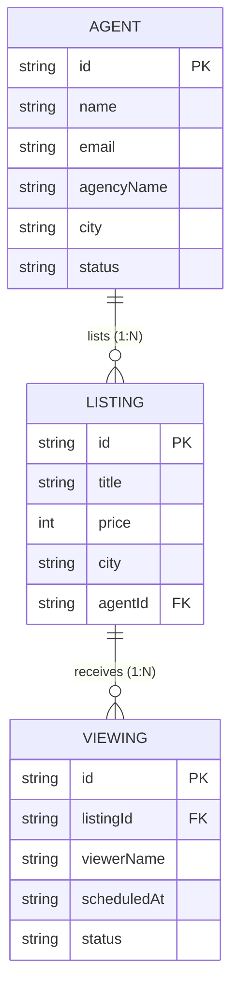

# Momentum Properties API

Task 1 — Build and Serve a Consumable REST API for Momentum Properties.

---

## 1. Resource Design

### Identifier Strategy
All resources use generated, non-sequential identifiers (`cuid`) rather than sequential integers.
**Design Rationale:** Sequential integers (e.g., `/listings/1`, `/listings/2`) expose the application to resource enumeration attacks (IDOR) and allow external observers to easily infer total record counts, business growth rates, and activity volume. Non-sequential, cryptographically random or collision-resistant string IDs (`cuid`) prevent enumeration while remaining URL-safe.

---

### Resource Tables

#### 1. Agent (`/api/v1/agents`)
Represents real estate agents associated with property listings.

| Field | Type | Required / Optional | Key Type | Description |
| --- | --- | --- | --- | --- |
| `id` | String (`cuid`) | Required | Primary Key | Generated non-sequential identifier |
| `name` | String | Required | - | Full name of the agent |
| `email` | String | Required | Unique | Primary email address |
| `phone` | String | Required | - | Contact phone number |
| `agencyName` | String | Required | - | Real estate agency or brokerage name |
| `city` | String | Required | Filterable | Primary operating city (Filter: `city`) |
| `licenseNumber` | String | Required | Unique | State real estate license identifier |
| `status` | Enum (`ACTIVE`, `INACTIVE`) | Required | Filterable | Operational status (Filter: `status`, Default: `ACTIVE`) |
| `createdAt` | DateTime (ISO 8601) | Required | - | Timestamp when record was created |
| `updatedAt` | DateTime (ISO 8601) | Required | - | Timestamp when record was last updated |

*List Filter Fields:* `city` (case-insensitive substring), `status` (exact match: `ACTIVE`, `INACTIVE`).
*List Sort Fields:* `name`, `city`, `agencyName`, `status`, `createdAt`, `updatedAt`.

---

#### 2. Listing (`/api/v1/listings`)
Represents properties available for sale or rent.

| Field | Type | Required / Optional | Key Type | Description |
| --- | --- | --- | --- | --- |
| `id` | String (`cuid`) | Required | Primary Key | Generated non-sequential identifier |
| `title` | String | Required | - | Concise descriptive title of the listing |
| `description` | String | Required | - | Detailed description of the property |
| `price` | Int | Required | Filterable | Listing price in USD minor units (cents, e.g., $500,000.00 stored as `50000000`). Single-currency API (USD). |
| `propertyType` | Enum (`APARTMENT`, `HOUSE`, `CONDO`, `TOWNHOUSE`, `LAND`) | Required | Filterable | Category of property |
| `status` | Enum (`AVAILABLE`, `PENDING`, `SOLD`, `RENTED`) | Required | Filterable | Listing availability status (Default: `AVAILABLE`) |
| `bedrooms` | Int | Required | - | Number of bedrooms |
| `bathrooms` | Float | Required | - | Number of bathrooms (intentionally `Float` to support half-baths like 1.5 or 2.5) |
| `squareFeet` | Int | Optional | - | Total living area size in square feet |
| `address` | String | Required | - | Street address |
| `city` | String | Required | Filterable | City location (Filter: `city`) |
| `state` | String | Required | - | State abbreviation (e.g., `CA`, `NY`) |
| `zipCode` | String | Required | - | Postal zip code |
| `agentId` | String (`cuid`) | Required | Foreign Key | References `Agent.id` |
| `createdAt` | DateTime (ISO 8601) | Required | - | Timestamp when record was created |
| `updatedAt` | DateTime (ISO 8601) | Required | - | Timestamp when record was last updated |

*List Filter Fields:* `city` (case-insensitive substring), `minPrice` / `maxPrice` (numeric integer range in cents), `propertyType`, `status`, `agentId`.
*List Sort Fields:* `price`, `bedrooms`, `bathrooms`, `city`, `createdAt`, `updatedAt`.

> **Money Storage Rationale:** `Listing.price` is stored as an integer representing minor units (USD cents). Floating-point or decimal storage introduces binary rounding errors that compound over calculations; integer minor units avoid floating-point imprecision entirely. The API assumes a single currency (USD). `Listing.price` is the single monetary field in the entire API domain model (`Agent` and `Viewing` have no financial fields).

> **Bathrooms Type Note:** `Listing.bathrooms` is intentionally `Float` (not `Int`) because half-bathrooms (e.g., 1.5, 2.5, 3.5) are a standard, real distinction in real estate property listings.

---

#### 3. Viewing (`/api/v1/viewings`)
Represents scheduled viewing appointments for listings.

| Field | Type | Required / Optional | Key Type | Description |
| --- | --- | --- | --- | --- |
| `id` | String (`cuid`) | Required | Primary Key | Generated non-sequential identifier |
| `listingId` | String (`cuid`) | Required | Foreign Key | References `Listing.id` |
| `viewerName` | String | Required | - | Name of prospective buyer/tenant |
| `viewerEmail` | String | Required | - | Email address of prospective buyer/tenant |
| `viewerPhone` | String | Required | - | Phone number of prospective buyer/tenant |
| `scheduledAt` | DateTime (ISO 8601) | Required | - | Date and time of scheduled viewing appointment |
| `status` | Enum (`SCHEDULED`, `COMPLETED`, `CANCELLED`, `NO_SHOW`) | Required | Filterable | Appointment status (Filter: `status`, Default: `SCHEDULED`) |
| `notes` | String | Optional | - | Additional comments or requests from viewer |
| `createdAt` | DateTime (ISO 8601) | Required | - | Timestamp when record was created |
| `updatedAt` | DateTime (ISO 8601) | Required | - | Timestamp when record was last updated |

*List Filter Fields:* `status` (exact match), `listingId` (exact match on foreign key).
*List Sort Fields:* `scheduledAt`, `status`, `createdAt`, `updatedAt`.

---

### Resource Relationships



- **Agent to Listing (1:N)**: An `Agent` can manage zero, one, or many `Listings`. Every `Listing` belongs to exactly one `Agent` (`Listing.agentId` foreign key referencing `Agent.id`).
- **Listing to Viewing (1:N)**: A `Listing` can have zero, one, or many scheduled `Viewings`. Every `Viewing` is booked for exactly one `Listing` (`Viewing.listingId` foreign key referencing `Listing.id`).

---

## 2. Embedded Relational Data Specification

To optimize network performance and eliminate $N+1$ query cascades in client applications, selected endpoints deliberately embed relational context:

1. **`GET /api/v1/listings` (Collection)**:
   - **Embedded Resource:** `agent` (depth 1)
   - **Fields Included:** `id`, `name`, `email`, `phone`, `agencyName`
   - **Rationale:** Property listing feeds and search results require displaying the listing agent's name and brokerage. Embedding this basic contact data eliminates $N$ additional API calls for a page of listings.

2. **`GET /api/v1/listings/[id]` (Single Item)**:
   - **Embedded Resources:**
     - `agent` (depth 1: `id`, `name`, `email`, `phone`, `agencyName`, `city`)
     - `viewings` (depth 1: up to 10 upcoming scheduled appointments ordered by `scheduledAt asc`)
   - **Rationale:** Viewing a property's detail view requires knowing both the managing agent and scheduled appointments for calendar scheduling.

3. **`GET /api/v1/agents/[id]` (Single Item)**:
   - **Embedded Resource:** `listings` (depth 1: up to 5 most recent listings managed by this agent, ordered by `createdAt desc`)
   - **Rationale:** An agent profile view benefits from an immediate preview of their current property portfolio.

4. **`GET /api/v1/viewings` & `GET /api/v1/viewings/[id]`**:
   - **Embedded Resource:** `listing` (depth 1: `id`, `title`, `address`, `city`, `price`)
   - **Rationale:** A viewing appointment is meaningless without the identity and address of the property being visited.

---

## 3. Endpoints Documentation

All endpoints are versioned under `/api/v1/`.

### Response Envelopes

#### Success Collection Envelope
```json
{
  "data": [ ... ],
  "meta": {
    "total": 600,
    "limit": 20,
    "offset": 0,
    "hasMore": true
  }
}
```

#### Success Single-Item Envelope
```json
{
  "data": { ... }
}
```

#### Error Envelope
```json
{
  "error": {
    "code": "BAD_REQUEST",
    "message": "Offset must be greater than or equal to 0"
  }
}
```

---

### Agents Endpoints

#### `GET /api/v1/agents`
Retrieve a paginated collection of real estate agents.

**Query Parameters:**
- `limit` (integer, default: `20`, max: `100` — clamped if exceeded)
- `offset` (integer, default: `0` — returns 400 if negative)
- `sort` (string, default: `createdAt` — allowed: `name`, `city`, `agencyName`, `status`, `createdAt`, `updatedAt`)
- `order` (string, default: `desc` — allowed: `asc`, `desc`)
- `city` (string, optional — case-insensitive substring match)
- `status` (string, optional — `ACTIVE`, `INACTIVE`)

**Example Request:**
```bash
curl -s -i "https://<host>/api/v1/agents?city=New%20York&limit=2"
```

**Example Response:**
```json
{
  "data": [
    {
      "id": "cmuw1zjkz00007c9o2uvgfa4h",
      "name": "Jane Doe",
      "email": "agent.1.janedoe@momentumproperties.com",
      "phone": "(212) 555-0199",
      "agencyName": "New York Real Estate Group",
      "city": "New York",
      "licenseNumber": "LIC-NEW-10001",
      "status": "ACTIVE",
      "createdAt": "2026-10-06T02:22:16.200Z",
      "updatedAt": "2026-10-06T02:22:16.200Z"
    }
  ],
  "meta": {
    "total": 12,
    "limit": 2,
    "offset": 0,
    "hasMore": true
  }
}
```

#### `GET /api/v1/agents/:id`
Retrieve a single agent by ID (includes recent listings).

**Example Request:**
```bash
curl -s -i "https://<host>/api/v1/agents/cmuw1zjkz00007c9o2uvgfa4h"
```

#### `POST /api/v1/agents`
Create a new agent.

**Required Body Fields:** `name`, `email`, `phone`, `agencyName`, `city`, `licenseNumber`. (Returns 422 if any required field is missing).

---

### Listings Endpoints

#### `GET /api/v1/listings`
Retrieve a paginated collection of property listings.

**Query Parameters:**
- `limit` (integer, default: `20`, max: `100` — clamped if exceeded)
- `offset` (integer, default: `0` — returns 400 if negative)
- `sort` (string, default: `createdAt` — allowed: `price`, `bedrooms`, `bathrooms`, `city`, `createdAt`, `updatedAt`)
- `order` (string, default: `desc` — allowed: `asc`, `desc`)
- `city` (string, optional — case-insensitive substring match)
- `minPrice` (integer in cents, optional — minimum price filter)
- `maxPrice` (integer in cents, optional — maximum price filter)
- `propertyType` (string, optional — `APARTMENT`, `HOUSE`, `CONDO`, `TOWNHOUSE`, `LAND`)
- `status` (string, optional — `AVAILABLE`, `PENDING`, `SOLD`, `RENTED`)
- `agentId` (string, optional — exact match on agent ID)

**Example Request:**
```bash
curl -s -i "https://<host>/api/v1/listings?city=Austin&limit=2"
```

**Example Response:**
```json
{
  "data": [
    {
      "id": "cmuw1zktp010n7c9o10mgkeao",
      "title": "round 2BR apartment in Austin",
      "description": "Stunning apartment offering 2 bedrooms and 1.6 bathrooms in desirable Austin...",
      "price": 260343300,
      "propertyType": "APARTMENT",
      "status": "SOLD",
      "bedrooms": 2,
      "bathrooms": 1.6,
      "squareFeet": 604,
      "address": "346 Buckridge Shore",
      "city": "Austin",
      "state": "TX",
      "zipCode": "76123",
      "agentId": "cmuw1zjvl005t7c9oeyyj9rb3",
      "createdAt": "2026-10-06T02:22:17.389Z",
      "updatedAt": "2026-10-06T02:22:17.389Z",
      "agent": {
        "id": "cmuw1zjvl005t7c9oeyyj9rb3",
        "name": "Jim Hudson PhD",
        "email": "agent.210.terri.kling95@momentumproperties.com",
        "phone": "(622) 590-5014",
        "agencyName": "Austin Real Estate Group"
      }
    }
  ],
  "meta": {
    "total": 24,
    "limit": 2,
    "offset": 0,
    "hasMore": true
  }
}
```

#### `GET /api/v1/listings/:id`
Retrieve a single listing by ID (includes managing agent and scheduled viewings).

**Example Request:**
```bash
curl -s -i "https://<host>/api/v1/listings/cmuw1zktp010n7c9o10mgkeao"
```

#### `POST /api/v1/listings`
Create a new property listing.

**Required Body Fields:** `title`, `description`, `price` (cents), `propertyType`, `bedrooms`, `bathrooms`, `address`, `city`, `state`, `zipCode`, `agentId`.

---

### Viewings Endpoints

#### `GET /api/v1/viewings`
Retrieve a paginated collection of scheduled viewings.

**Query Parameters:**
- `limit` (integer, default: `20`, max: `100`)
- `offset` (integer, default: `0`)
- `sort` (string, default: `scheduledAt` — allowed: `scheduledAt`, `status`, `createdAt`, `updatedAt`)
- `order` (string, default: `desc`)
- `status` (string, optional — `SCHEDULED`, `COMPLETED`, `CANCELLED`, `NO_SHOW`)
- `listingId` (string, optional — exact match on listing ID)

#### `POST /api/v1/viewings`
Book a viewing appointment.

**Required Body Fields:** `listingId`, `viewerName`, `viewerEmail`, `viewerPhone`, `scheduledAt` (ISO 8601).

---

## 4. Design Decisions

### 1. Why These Three Resources?
The core domain is property discovery and client acquisition:
- **Agents:** Service providers managing properties and client relationships.
- **Listings:** The core inventory being browsed and transacted.
- **Viewings:** The primary engagement activity connecting prospective buyers/tenants to inventory.
Together they form a coherent, two-level relational hierarchy (`Agent` $\rightarrow$ `Listing` $\rightarrow$ `Viewing`).

### 2. Why Generated Identifiers (CUID)?
Sequential IDs (`1`, `2`, `3`) allow trivial enumeration of records (IDOR security risks) and expose commercial intelligence (e.g. competitor scraping total sales volume or user growth). `cuid` values are cryptographically secure, collision-resistant, URL-safe strings that prevent enumeration while supporting database indexing.

### 3. Why Offset Pagination (and Tradeoffs vs Cursor)?
- **Chosen: Limit/Offset Pagination:** Real estate exploration workflows rely on knowing total matching record counts (`meta.total`) and jumping across arbitrary pages (page 1, 2, 3...) when applying multiple filters (e.g., city, price range).
- **Tradeoff vs Cursor:** Cursor pagination (`?after=<id>`) provides superior performance for infinite-scroll feeds with high write volume (no page drift), but does not permit jumping directly to arbitrary pages or showing total page numbers. For a catalog search API with bounded dataset queries, limit/offset offers the superior developer experience.

### 4. Response Envelope Shape
A consistent top-level JSON structure is enforced across every single endpoint:
- Success collections: `{ "data": [...], "meta": { ... } }`
- Success single item: `{ "data": { ... } }`
- Errors: `{ "error": { "code": "...", "message": "..." } }`
This strict convention eliminates client-side guesswork, allows generic network adapters, and ensures errors always convey machine-readable `code` and human-readable `message` fields with honest HTTP status codes (never 200 with an error in the body).

### 5. Persistent Rate Limiting (Why Not In-Memory?)
On serverless deployment targets (such as Vercel), functions execute across ephemeral, stateless containers that spin up and down dynamically. An in-memory rate limiter (e.g. a Node.js `Map`) resets on every container cold start and fails to coordinate state across concurrent instances, rendering rate limiting ineffective in production. 
Momentum Properties API stores rate limit counters in a dedicated `RateLimitBucket` table in PostgreSQL, keyed on `${ip}:${endpoint}` with atomic upserts and window tracking. This guarantees rate limits are strictly enforced across all serverless function instances.
Configuration parameters live in `lib/config/rate-limit.ts` rather than hardcoded in route handlers.
