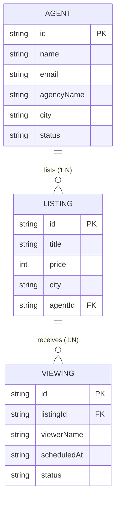

# Momentum Properties API

Task 1 — Build and Serve a Consumable REST API for Momentum Properties.

---

## 1. Resource Design

### Identifier Strategy
All resources use generated, non-sequential identifiers (`cuid`) rather than sequential integers.
**Design Rationale:** Sequential integers (e.g., `/listings/1`, `/listings/2`) expose the application to resource enumeration attacks (IDOR) and allow external observers to easily infer total record counts, business growth rates, and activity volume. Non-sequential, cryptographically random or collision-resistant string IDs (`cuid`) prevent enumeration while remaining URL-safe.

---

### Resource Tables

#### 1. Agent (`/api/v1/agents`)
Represents real estate agents associated with property listings.

| Field | Type | Required / Optional | Key Type | Description |
| --- | --- | --- | --- | --- |
| `id` | String (`cuid`) | Required | Primary Key | Generated non-sequential identifier |
| `name` | String | Required | - | Full name of the agent |
| `email` | String | Required | Unique | Primary email address |
| `phone` | String | Required | - | Contact phone number |
| `agencyName` | String | Required | - | Real estate agency or brokerage name |
| `city` | String | Required | Filterable | Primary operating city (Filter: `city`) |
| `licenseNumber` | String | Required | Unique | State real estate license identifier |
| `status` | Enum (`ACTIVE`, `INACTIVE`) | Required | Filterable | Operational status (Filter: `status`, Default: `ACTIVE`) |
| `createdAt` | DateTime (ISO 8601) | Required | - | Timestamp when record was created |
| `updatedAt` | DateTime (ISO 8601) | Required | - | Timestamp when record was last updated |

*List Filter Fields:* `city` (case-insensitive substring), `status` (exact match: `ACTIVE`, `INACTIVE`).
*List Sort Fields:* `name`, `city`, `agencyName`, `status`, `createdAt`, `updatedAt`.

---

#### 2. Listing (`/api/v1/listings`)
Represents properties available for sale or rent.

| Field | Type | Required / Optional | Key Type | Description |
| --- | --- | --- | --- | --- |
| `id` | String (`cuid`) | Required | Primary Key | Generated non-sequential identifier |
| `title` | String | Required | - | Concise descriptive title of the listing |
| `description` | String | Required | - | Detailed description of the property |
| `price` | Int | Required | Filterable | Listing price in USD minor units (cents, e.g., $500,000.00 stored as `50000000`). Single-currency API (USD). |
| `propertyType` | Enum (`APARTMENT`, `HOUSE`, `CONDO`, `TOWNHOUSE`, `LAND`) | Required | Filterable | Category of property |
| `status` | Enum (`AVAILABLE`, `PENDING`, `SOLD`, `RENTED`) | Required | Filterable | Listing availability status (Default: `AVAILABLE`) |
| `bedrooms` | Int | Required | - | Number of bedrooms |
| `bathrooms` | Float | Required | - | Number of bathrooms (intentionally `Float` to support half-baths like 1.5 or 2.5) |
| `squareFeet` | Int | Optional | - | Total living area size in square feet |
| `address` | String | Required | - | Street address |
| `city` | String | Required | Filterable | City location (Filter: `city`) |
| `state` | String | Required | - | State abbreviation (e.g., `CA`, `NY`) |
| `zipCode` | String | Required | - | Postal zip code |
| `agentId` | String (`cuid`) | Required | Foreign Key | References `Agent.id` |
| `createdAt` | DateTime (ISO 8601) | Required | - | Timestamp when record was created |
| `updatedAt` | DateTime (ISO 8601) | Required | - | Timestamp when record was last updated |

*List Filter Fields:* `city` (case-insensitive substring), `minPrice` / `maxPrice` (numeric integer range in cents), `propertyType`, `status`, `agentId`.
*List Sort Fields:* `price`, `bedrooms`, `bathrooms`, `city`, `createdAt`, `updatedAt`.

> **Money Storage Rationale:** `Listing.price` is stored as an integer representing minor units (USD cents). Floating-point or decimal storage introduces binary rounding errors that compound over calculations; integer minor units avoid floating-point imprecision entirely. The API assumes a single currency (USD). `Listing.price` is the single monetary field in the entire API domain model (`Agent` and `Viewing` have no financial fields).

> **Bathrooms Type Note:** `Listing.bathrooms` is intentionally `Float` (not `Int`) because half-bathrooms (e.g., 1.5, 2.5, 3.5) are a standard, real distinction in real estate property listings.

---

#### 3. Viewing (`/api/v1/viewings`)
Represents scheduled viewing appointments for listings.

| Field | Type | Required / Optional | Key Type | Description |
| --- | --- | --- | --- | --- |
| `id` | String (`cuid`) | Required | Primary Key | Generated non-sequential identifier |
| `listingId` | String (`cuid`) | Required | Foreign Key | References `Listing.id` |
| `viewerName` | String | Required | - | Name of prospective buyer/tenant |
| `viewerEmail` | String | Required | - | Email address of prospective buyer/tenant |
| `viewerPhone` | String | Required | - | Phone number of prospective buyer/tenant |
| `scheduledAt` | DateTime (ISO 8601) | Required | - | Date and time of scheduled viewing appointment |
| `status` | Enum (`SCHEDULED`, `COMPLETED`, `CANCELLED`, `NO_SHOW`) | Required | Filterable | Appointment status (Filter: `status`, Default: `SCHEDULED`) |
| `notes` | String | Optional | - | Additional comments or requests from viewer |
| `createdAt` | DateTime (ISO 8601) | Required | - | Timestamp when record was created |
| `updatedAt` | DateTime (ISO 8601) | Required | - | Timestamp when record was last updated |

*List Filter Fields:* `status` (exact match), `listingId` (exact match on foreign key).
*List Sort Fields:* `scheduledAt`, `status`, `createdAt`, `updatedAt`.

---

### Resource Relationships

- **Agent to Listing (1:N)**: An `Agent` can manage zero, one, or many `Listings`. Every `Listing` belongs to exactly one `Agent` (`Listing.agentId` foreign key referencing `Agent.id`).
- **Listing to Viewing (1:N)**: A `Listing` can have zero, one, or many scheduled `Viewings`. Every `Viewing` is booked for exactly one `Listing` (`Viewing.listingId` foreign key referencing `Listing.id`).
